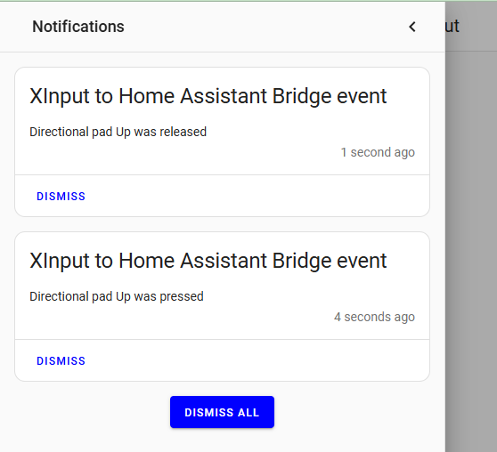

XInput to Home Assitant bridge
==============================

Use an XInput to expose some events to Home Assistant via webhook.

Setup:
---
1. Create Home Assistant automation (use `home_assistant_automation_example.yaml` as the example)
1. Run `pip install pyglet` 
1. Run `pip install requests` 
1. Copy `config.ini.example` to `config.ini`
	1. Update values in `config.ini`

Usage:
---
1. Connect XInput device
1. Run `python bridge.py`
1. Hold "Left Shoulder" and "Menu" buttons and press "Directional Pad Up" button - you should see a notification in Home Asssistant

Result:
---

Related video demo:
---
Adjusting TV volume without leaving the game - more details in the video description.

